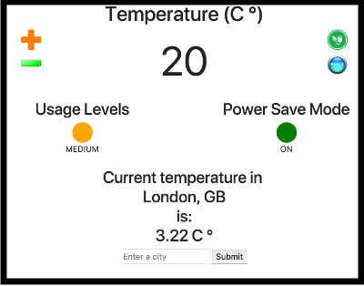

  


Thermostat Controller using Javascript
=================

## What is the aim of this application
This is a simple implementation of programming the interface of a thermostat,
using Javascript and jQuery, which was used to familiarise with the aforementioned technologies.

## How to use this app

First you need to clone the depository on your local machine. To do so, please open your favourite CLI and use the following commands:

```
git clone git@github.com:lunaticnick/makersacademy-mcw05-js-thermostat.git local_directory_name
cd local_directory_name
```

Then there are two options:

**Use the Thermostat interface**
To start playing with the interface of the thermostat, please open ```thermostat.html``` located in ***src*** folder

**Test the Thermostat interface**
To have a look at the test for this app (written in [Jasmine](https://jasmine.github.io)), please open ```SpecRunner.html``` located in the root.

In addition, there is a form that you can fill, which will allow you to see the temperature in other cities around the world.

## Thermostat interface Image

